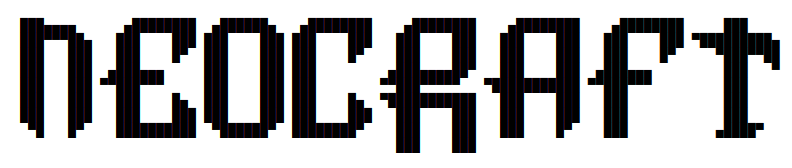
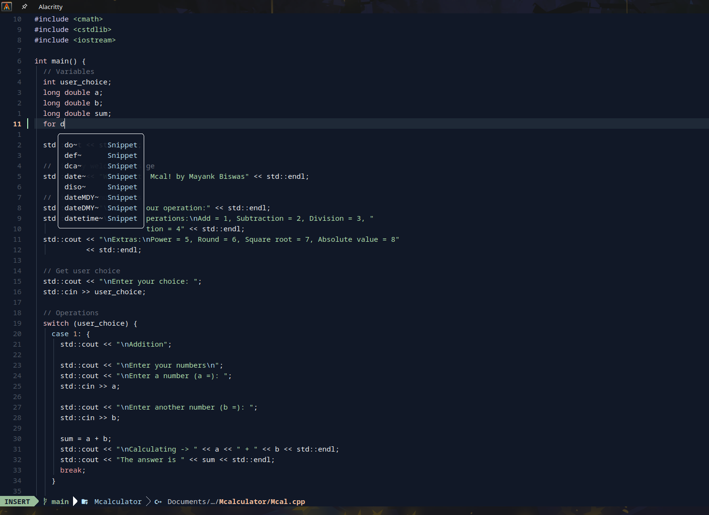

<div align="center">
  
</div>

<hr>


**Neocraft** is a Neovim setup built on top of [💤 lazy.nvim](https://github.com/folke/lazy.nvim) to simplify customization and extension of your configuration. Neocraft combines the flexibility of custom configurations with the ease of a pre-configured environment, making it ideal for developers.





## ✨ Features

- 🔥 Converts Neovim into a powerful IDE
- 💤 Easily customize and extend your configuration with [lazy.nvim](https://github.com/folke/lazy.nvim)
- 🚀 Optimized for performance
- 📦 Includes a rich set of pre-configured plugins

## ⚡️ Requirements

- Neovim >= **0.9.0** (built with **LuaJIT**)
- Git >= **2.19.0** (for partial clones support)
- a [Nerd Font](https://www.nerdfonts.com/) **_(optional)_**
- a **C** compiler for `nvim-treesitter`. See [requirements](https://github.com/nvim-treesitter/nvim-treesitter#requirements)

## 🚀 Getting Started

- Make the folder (only if you havent)

  ```sh
  mkdir ~/.config/nvim
  ```

- Clone the starter

  ```sh
  git clone https://github.com/lordxexsteros/NeoCraft-stater ~/.config/nvim
  ```

- Remove the `.git` folder, so you can add it to your own repo later

  ```sh
   rm -rf ~/.config/nvim/.git
  ```

- Start Neovim!

  ```sh
  nvim
  ```
